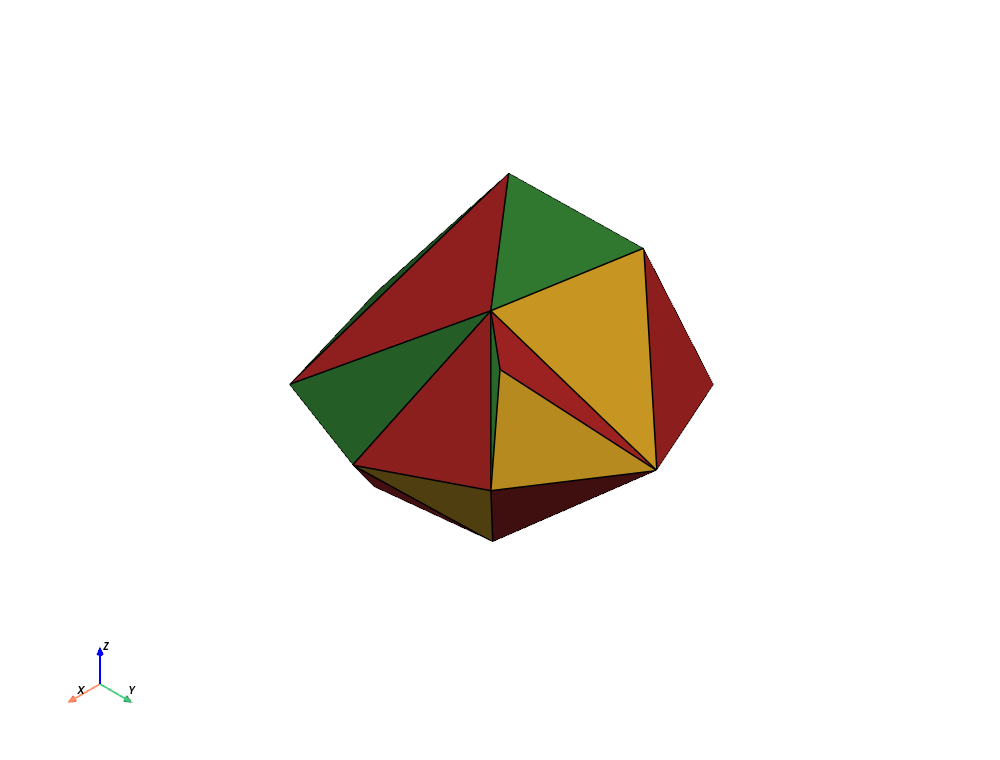

# Enveloppe convexe 3D incrémentale

[](https://www.python.org/)
[](#validation)
[](LICENSE)

Reconstruction en Python d’un projet de géométrie algorithmique initialement réalisé en **Super-Pascal en 1991**.

Le programme construit progressivement l’enveloppe convexe d’un nuage de points tridimensionnels. À chaque insertion, le moteur historique ne modifie que la partie visible de la surface : détection des faces visibles, calcul de l’horizon, suppression locale puis création d’un nouveau capuchon triangulé.



> **English summary** — Incremental 3D convex hull reconstruction from Excel, CSV or Parquet point clouds, with DuckDB traceability, SciPy validation, PyVista visualization and a custom historical face–horizon update algorithm.

## Points forts

- import de données réelles depuis **Excel, CSV ou Parquet** ;
- contrôle qualité et conservation des lignes rejetées ;
- stockage local et traçable dans **DuckDB** ;
- moteur historique incrémental sans reconstruction globale à chaque point ;
- moteur SciPy/Qhull conservé comme référence ;
- validation topologique, géométrique et numérique ;
- coloration des faces avec quatre couleurs ;
- rendu final interactif avec **PyVista** ;
- exports Excel, CSV, VTP, PLY, PNG et JSON ;
- un dossier autonome et reproductible pour chaque exécution ;
- trajectoire documentée vers **Parquet + Polars/DuckDB** pour les très grands volumes.

## Résultat principal

Sur le cas difficile où tous les points sont placés sur une sphère, les mesures locales ont donné :

| Points | Reconstruction SciPy à chaque insertion | Moteur historique local | Accélération |
|---:|---:|---:|---:|
| 1 000 | 45,918 s | 0,774 s | ×59,34 |
| 1 500 | 102,594 s | 1,354 s | ×75,77 |
| 2 000 | 181,721 s | 2,077 s | ×87,49 |

Pour les trois tailles, la validation finale SciPy/Qhull a confirmé le même nombre de sommets et de faces, avec des écarts d’aire et de volume de l’ordre de `10⁻¹⁴` au maximum.

## Principe algorithmique

Pour une face orientée `(a, b, c)` et un nouveau point `p`, le signe du produit mixte détermine si la face est visible :

```text
D(a,b,c,p) = ((b-a) × (c-a)) · (p-a)
```

Le moteur procède ainsi :

```text
nouveau point
    ↓
recherche des faces visibles
    ↓
extraction des arêtes de l’horizon
    ↓
suppression locale des faces visibles
    ↓
création des triangles horizon + nouveau point
    ↓
compaction des sommets devenus intérieurs
    ↓
contrôles et coloration
```

La coloration améliore la lecture visuelle et fournit un contrôle combinatoire. La décision géométrique repose sur les produits mixtes et non sur le théorème des quatre couleurs.

## Installation sous Linux

```bash
python3 -m venv .venv
source .venv/bin/activate
python -m pip install --upgrade pip
python -m pip install -r requirements.txt
python -m pytest
```

Pour ajouter les outils de développement :

```bash
python -m pip install -r requirements-dev.txt
```

## Démonstration rapide

Le dépôt contient un fichier Excel de 250 points :

```bash
python app.py process \
    --input data/imports/points_exemple.xlsx \
    --sheet Points \
    --engine historical \
    --record-every 50 \
    --progress-every 100 \
    --show
```

La fenêtre finale possède un fond noir. La surface peut être tournée avec le bouton gauche de la souris et zoomée avec la molette.

## Utiliser un vrai fichier Excel

Structure minimale :

| point_id | x | y | z |
|---:|---:|---:|---:|
| 1 | 12.45 | -7.20 | 3.18 |
| 2 | 11.82 | -6.91 | 3.77 |

Commande :

```bash
python app.py process \
    --input data/imports/coordonnees_reelles.xlsx \
    --sheet Points \
    --show
```

Pour des noms de colonnes différents :

```bash
python app.py process \
    --input data/imports/mesures.xlsx \
    --sheet Coordonnees \
    --x-column coord_x \
    --y-column coord_y \
    --z-column coord_z \
    --id-column identifiant \
    --label-column nom_point \
    --show
```

## Générer un fichier de test

Le générateur crée un vrai fichier qui repasse ensuite par le pipeline standard :

```bash
python app.py generate-file \
    --points 10000 \
    --distribution volume \
    --seed 42 \
    --output data/imports/test_10000.parquet
```

Puis :

```bash
python app.py process \
    --input data/imports/test_10000.parquet \
    --record-every 500 \
    --progress-every 1000 \
    --show
```

Distributions disponibles : `volume`, `sphere`, `cube`.

## Comparer les deux moteurs

```bash
python app.py benchmark \
    --sizes 1000 1500 2000 \
    --distributions sphere \
    --engines scipy historical \
    --max-seconds 300 \
    --progress-every 250
```

- `scipy` reconstruit l’enveloppe complète après chaque insertion ;
- `historical` met à jour uniquement les faces visibles et l’horizon.

## Sorties d’une exécution

Chaque traitement crée un répertoire indépendant :

```text
data/runs/<run_id>/
├── points.duckdb
├── report.md
├── metrics.json
├── source_original.*
├── sql/
│   ├── attach_database.sql
│   ├── inspect_database.sql
│   └── detach_database.sql
└── exports/
    ├── clean_points.xlsx
    ├── rejected_points.xlsx
    ├── final_vertices.xlsx
    ├── final_faces.xlsx
    ├── results.xlsx
    ├── final_vertices.csv
    ├── final_faces.csv
    ├── final_hull.vtp
    ├── final_hull.ply
    └── final_hull.png
```

Un exemple léger est disponible dans [`examples/sample_run`](examples/sample_run).

## Explorer la base DuckDB dans VS Code

Après le calcul, ouvrir dans le dossier du run :

```text
sql/attach_database.sql
```

Puis l’exécuter avec `Ctrl+Entrée`. Le fichier `inspect_database.sql` contient les requêtes permettant d’afficher :

- les points sources et nettoyés ;
- les rejets ;
- les sommets et faces finales ;
- les étapes enregistrées ;
- les contrôles de validation.

Chaque run utilisant sa propre base, une ancienne base peut rester attachée sans bloquer un nouveau calcul.

## Validation

Le pipeline vérifie notamment :

- quatre points initiaux non coplanaires ;
- trois sommets distincts par face ;
- exactement deux faces par arête ;
- surface fermée et orientée ;
- formule d’Euler `V - E + F = 2` ;
- relation triangulée `3F = 2E` ;
- monotonie du volume ;
- coloration correcte des faces voisines ;
- comparaison indépendante avec SciPy/Qhull sous un seuil configurable.

Lancer la suite de tests :

```bash
python -m pytest
```

## Architecture

```text
app.py                       interface en ligne de commande
pipeline_v5.py               import, qualité, DuckDB, rapports et exports
incremental_hull_engine.py   moteur historique local
hull_engine.py               moteur SciPy de référence
storage.py                   stockage et benchmarks historiques
tests/                       tests unitaires et d’intégration
MEMO_TECHNIQUE_V5.md         démonstration mathématique et technique
examples/sample_run/         exemple de résultats publiables
```

## Grands volumes

Excel est pratique pour l’inspection manuelle, mais pas pour des millions de points. La trajectoire prévue est :

```text
Parquet
    ↓
Polars scan_parquet ou requêtes DuckDB
    ↓
filtrage paresseux des colonnes utiles
    ↓
lecture par lots
    ↓
conversion NumPy limitée aux coordonnées
    ↓
moteur incrémental
```

Polars optimise la préparation tabulaire ; il ne remplace pas le moteur géométrique et ne réduit pas le nombre de sommets extrêmes dans le pire cas.

## Documentation

- [`MEMO_TECHNIQUE_V5.md`](MEMO_TECHNIQUE_V5.md) — algorithmes, équations, validations, performances et limites ;
- [`VALIDATION_V4.md`](VALIDATION_V4.md) — passage du prototype global au moteur historique ;
- [`ROADMAP.md`](ROADMAP.md) — évolutions possibles ;
- [`docs/PUBLICATION_GITHUB.md`](docs/PUBLICATION_GITHUB.md) — publication du dépôt ;
- [`CHANGELOG.md`](CHANGELOG.md) — historique des versions.
- [`AUDIT_SECURITE_V5.md`](AUDIT_SECURITE_V5.md) — audit de sécurité de l'nsemble du code réalisé par ChatGPT 5.5 version avancée.

## Limites

- l’enveloppe convexe comble toutes les cavités et concavités ;
- la v5 matérialise encore la table complète avec pandas ;
- les données presque coplanaires nécessitent une tolérance numérique prudente ;
- afficher tous les points d’un très grand nuage peut coûter davantage que l’enveloppe elle-même ;
- les prédicats géométriques utilisent la double précision standard.

## Origine du projet

Le dépôt documente une démarche complète : projet universitaire personnel de 1991 (2eme année Deug A université Sophia-Antipolis), reconstruction théorique, prototype SciPy, mesure de sa limite quadratique, développement d’un moteur incrémental local puis création d’un pipeline scientifique reproductible.

## Licence

Projet distribué sous licence [MIT](LICENSE).
